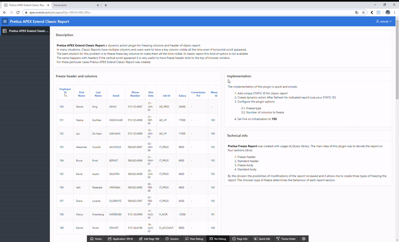

# Pretius Extend Classic Report

Pretius Extend Classic Report is dynamic action plugin for freezing columns and header of classic report in Oracle Application Express(APEX).

## Table of Contents
- [Information about plugin](#information-about-plugin)
- [Preview](#preview)
- [License](#license)
- [Features at glance](#features-at-glance)
- [Roadmap](#roadmap)
- [Installation](#installation)
  - [Installation package](#installation-package)
  - [Installation procedure](#installation-procedure)
- [Usage guide & Demo application](#usage-guide-demo-application)
- [Free support](#free-support)
  - [Bug reporting and change requests](#bug-reporting-and-change-requests)
  - [Implementation issues](#implementation-issues)
- [Become a contributor](#become-a-contributor)
- [Comercial support](#comercial-support)
- [Changelog](#changelog)
- [Known issues](#known-issues)
- [About Author](#about-author)
- [About Pretius](#about-pretius)

## Information about plugin

In many situations, Classic Reports have multiple columns and users want to have a key column visible all the time even if horizontal scroll appeared. The best solution for this problem is to freeze these key columns to make them all the time visible. In classic report this kind of option is not available. The same happens with headers if the vertical scroll appear. It is very useful to have freeze header stick to the top of browser window. For these particular cases The Pretius Extend Classic Report was created.

## Preview

## License

MIT

## Features at glance
* compatible with Oracle APEX 5.1, 18.x, 19.x
* freeze column in classic report
* freeze headers in classic report
* freezing also works in modal dialog pages

## Roadmap
* [ ] Floating scrollbar

## Installation

### Install procedure
Using Oracle APEX plugin wizard install the plugin file dynamic_action_plugin_pretius_extend_classic_report.sql

## Usage guide & Demo application

1. Create dynamic action _After Refresh_ for indicated report 
1. Configure the plugin options
  1. Freeze type - decide if you want freeze columns, headers or both
  1. Columns to freeze - number of columns to freeze
1. Set _Fire on Initialization_ to __YES__
1. Launch application

Demo application: https://apex.oracle.com/pls/apex/f?p=PRETIUS_EXTEND_CLASSIC_REPORT:100

## Free support
Pretius provides free support for the plugins at the GitHub platform. 
We monitor raised issues, prepare fixes, and answer your questions. However, please note that we deliver the plug-ins free of charge, and therefore we will not always be able to help you immediately. 

Interested in better support? 
* [Become a contributor!](#become-a-contributor) We always prioritize the issues raised by our contributors and fix them for free.
* [Consider comercial support.](#comercial-support) Options and benefits are described in the chapter below.

### Bug reporting and change requests
Have you found a bug or have an idea of additional features that the plugin could cover? Firstly, please check the Roadmap and Known issues sections. If your case is not on the lists, please open an issue on a GitHub page following these rules:
* issue should contain login credentials to the application at apex.oracle.com where the problem is reproduced;
* issue should include steps to reproduce the case in the demo application;
* issue should contain description about its nature.

### Implementation issues
If you encounter a problem during the plug-in implementation, please check out our demo application. We do our best to describe each possible use case precisely. If you can not find a solution or your problem is different, contact us: apex-plugins@pretius.com.

## Become a contributor!
We consider our plugins as genuine open source products, and we encourage you to become a contributor. Help us improve plugins by fixing bugs and developing extra features. Comment one of the opened issues or register a new one, to let others know what you are working on. When you finish, create a new pull request. We will review your code and add the changes to the repository.

By contributing to this repository, you help to build a strong APEX community. We will prioritize any issues raised by you in this and any other plugins.

## Comercial support
We are happy to share our experience for free, but we also realize that sometimes response time, quick implementation, SLA, and instant release for the latest version are crucial. That’s why if you need extended support for our plug-ins, please contact us at apex-plugins@pretius.com.
We offer:
* enterprise-level assistance;
* support in plug-ins implementation and utilization;
* dedicated contact channel to our developers;
* SLA at the level your organization require;
* priority update to next APEX releases and features listed in the roadmap.

## Changelog

### 1.0.0 
Initial Release

## Known issues

 
## About Author
Author | Github | Twitter | E-mail
-------|-------|---------|-------
Bartosz Sypuła | [@sypulabartosz](https://github.com/sypulabartosz) | [@sypulabartosz](https://twitter.com/sypulabartosz) | bsypula@pretius.com

Thanks to [@bostrowski](https://github.com/bostrowski) for pro tips, which I received and help in creation of the plugin

## About Pretius
Pretius Sp. z o.o. Sp. K.

Pretius is a software company specialized in Java-based and low-code applications, with a dedicated team of over 25 Oracle APEX developers.
Members of our APEX team are technical experts, have excellent communication skills, and work directly with end-users / business owners of the software. Some of them are also well-known APEX community members, winners of APEX competitions, and speakers at international conferences.
We are the authors of the translate-apex.com project and some of the best APEX plug-ins available at the apex.world.
We are located in Poland, but working globally. If you need the APEX support, contact us right now.

Address | Website | E-mail
--------|---------|-------
Żwirki i Wigury 16A, 02-092 Warsaw, Poland | [http://www.pretius.com](http://www.pretius.com) | [office@pretius.com](mailto:office@pretius.com)
